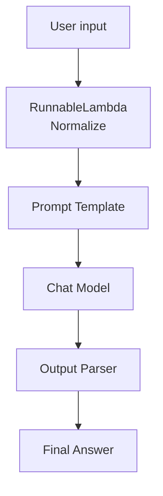
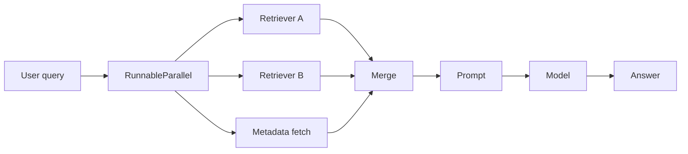
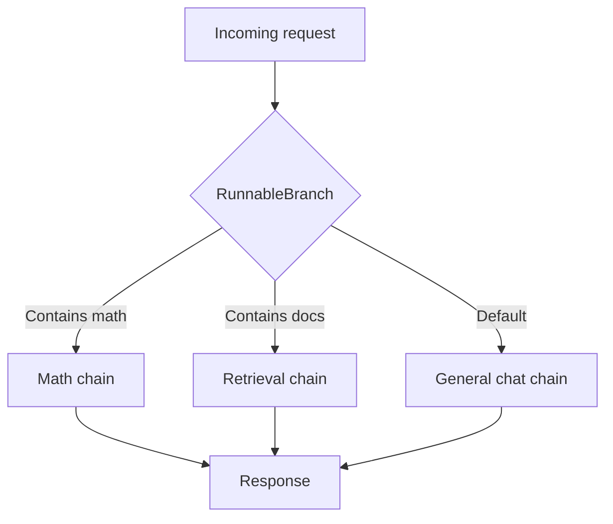

# LangChain Runnables: Practical Guide

## 1) What are runnables?

In LangChain, a **Runnable** is a composable unit of work that follows a common interface. In practice, that means you can connect building blocks such as prompt templates, models, retrievers, output parsers, and even plain Python functions into one pipeline.

The most common chain shape is:

`PromptTemplate -> Model -> OutputParser`

That is the core idea behind LangChain Expression Language (LCEL): simple components that can be chained together with `|`.

## 2) Why runnables matter

Runnables are useful because they give you:

- **Composition**: wire multiple steps together cleanly.
- **Reuse**: swap prompts, models, or parsers without rewriting everything.
- **Tracing and debugging**: each step is visible as a separate run.
- **Async / batch / streaming support**: useful when your app grows beyond a single call.

## 3) Common runnable-capable building blocks

These are the most common pieces you will use with runnables:

| Component | What it does | Typical use case |
|---|---|---|
| Prompt template | Builds the instruction/input sent to the model | Turn user input into a structured prompt |
| Chat model / LLM | Generates the response | Chatbot, summarization, extraction |
| Output parser | Converts raw model text into usable data | JSON, string, schema objects |
| Retriever | Fetches relevant documents | Semantic search, RAG |
| RunnableLambda | Wraps a Python function as a runnable | Custom transforms, filters, formatting |
| RunnablePassthrough | Passes data through unchanged | Preserve input while adding other fields |
| RunnableSequence | Runs steps one after another | Linear pipeline |
| RunnableParallel | Runs steps side by side | Fan-out to multiple branches |
| RunnableBranch | Chooses a path conditionally | Routing logic, classification |

## 4) Most useful types

### 4.1 RunnableSequence
A sequence is the default “pipeline” pattern. Each step feeds into the next.

**Use case**
- Prompt -> model -> parser
- Document processing pipeline
- Retrieval -> synthesis pipeline

### 4.2 RunnableParallel
Runs multiple steps on the same input at the same time.

**Use case**
- Run two retrievers and merge results
- Generate two variants of an answer
- Extract multiple features from the same text

### 4.3 RunnableLambda
Wraps a Python function so it can behave like a runnable.

**Use case**
- Preprocess input
- Postprocess output
- Custom routing / validation / formatting

### 4.4 RunnablePassthrough
Keeps the original input intact while adding or mapping other values.

**Use case**
- Keep the original question while also attaching retrieved context
- Build multi-field inputs for synthesis

### 4.5 RunnableBranch
Routes input to one of several chains based on a condition.

**Use case**
- Send “math” questions to a calculator chain
- Send “support” questions to a retrieval chain
- Send short prompts to a lightweight model and long prompts to a stronger one

## 5) How they fit together

A typical LCEL pipeline looks like this:

```text
User input
   ↓
Prompt template
   ↓
Model
   ↓
Output parser
   ↓
Final result
```

A more advanced workflow may look like:

```text
User input
   ├──> Retriever A
   ├──> Retriever B
   └──> Custom function
            ↓
         Merge
            ↓
         Model
            ↓
         Answer
```

## 6) Example 1 — Basic sequence

This is the classic runnable chain.

```python
from langchain_core.prompts import ChatPromptTemplate
from langchain_core.output_parsers import StrOutputParser
from langchain_openai import ChatOpenAI

prompt = ChatPromptTemplate.from_messages([
    ("system", "You are a concise technical assistant."),
    ("user", "Explain {topic} in 3 bullet points."),
])

model = ChatOpenAI(model="gpt-4.1-mini")
parser = StrOutputParser()

chain = prompt | model | parser

result = chain.invoke({"topic": "LangChain runnables"})
print(result)
```

### What happens here
1. The prompt template formats the input.
2. The chat model generates a response.
3. The parser converts the response to plain text.

## 7) Example 2 — RunnableLambda for custom preprocessing

Use this when you need your own Python logic inside the chain.

```python
from langchain_core.runnables import RunnableLambda
from langchain_core.prompts import ChatPromptTemplate
from langchain_core.output_parsers import StrOutputParser
from langchain_openai import ChatOpenAI

def normalize_input(data: dict) -> dict:
    question = data["question"].strip()
    return {"question": question.lower()}

preprocess = RunnableLambda(normalize_input)

prompt = ChatPromptTemplate.from_messages([
    ("system", "Answer clearly and directly."),
    ("user", "{question}"),
])

model = ChatOpenAI(model="gpt-4.1-mini")
parser = StrOutputParser()

chain = preprocess | prompt | model | parser

print(chain.invoke({"question": "   WHAT ARE RUNNABLES IN LANGCHAIN?   "}))
```

### Use case
This is ideal for:
- cleaning user input
- validation
- formatting metadata
- lightweight business rules

## 8) Example 3 — RunnableParallel for fan-out

Use this when the same input should be processed by more than one branch.

```python
from langchain_core.runnables import RunnableParallel, RunnableLambda

uppercase = RunnableLambda(lambda x: x["text"].upper())
word_count = RunnableLambda(lambda x: len(x["text"].split()))

parallel_chain = RunnableParallel(
    upper=uppercase,
    count=word_count,
)

print(parallel_chain.invoke({"text": "LangChain runnables are composable"}))
```

Expected shape:

```python
{
    "upper": "LANGCHAIN RUNNABLES ARE COMPOSABLE",
    "count": 4
}
```

### Use case
- Compare outputs from multiple paths
- Run two retrievers in parallel
- Compute several features from the same input

## 9) Example 4 — RunnablePassthrough with enrichment

This is a common pattern for retrieval-augmented generation.

```python
from langchain_core.runnables import RunnablePassthrough, RunnableLambda
from langchain_core.prompts import ChatPromptTemplate
from langchain_core.output_parsers import StrOutputParser
from langchain_openai import ChatOpenAI

def fake_retriever(question: str) -> str:
    return f"Relevant context for: {question}"

retriever = RunnableLambda(fake_retriever)

prompt = ChatPromptTemplate.from_messages([
    ("system", "Answer only from the provided context."),
    ("user", "Question: {question}
Context: {context}"),
])

model = ChatOpenAI(model="gpt-4.1-mini")
parser = StrOutputParser()

chain = (
    {
        "question": RunnablePassthrough(),
        "context": retriever,
    }
    | prompt
    | model
    | parser
)

print(chain.invoke("What is a runnable?"))
```

### Use case
This pattern is useful when:
- you want to keep the original user input
- you also want to fetch or compute extra fields
- you need a clean input object for the prompt

## 10) Example 5 — RunnableBranch for routing

Use branching when the workflow depends on the input.

```python
from langchain_core.runnables import RunnableBranch, RunnableLambda

math_chain = RunnableLambda(lambda x: f"Math route selected for: {x}")
chat_chain = RunnableLambda(lambda x: f"Chat route selected for: {x}")

router = RunnableBranch(
    (lambda x: "math" in x["topic"].lower(), math_chain),
    chat_chain,  # default branch
)

print(router.invoke({"topic": "math question"}))
print(router.invoke({"topic": "general question"}))
```

### Use case
- route to the right specialist
- choose model size dynamically
- send requests to different retrieval systems

## 11) Semantic search style workflow

For a semantic search app, the runnable flow is usually:

1. Receive the user query
2. Convert the query to embeddings
3. Search a vector database
4. Return the most relevant documents
5. Ask the model to synthesize the answer

```text
Query
  ↓
Embedding model
  ↓
Vector store search
  ↓
Top-k documents
  ↓
Prompt
  ↓
Chat model
  ↓
Answer
```

## 12) Full workflow diagram



## 13) Parallel retrieval workflow



## 14) Routing workflow



## 15) Practical guidance

Use a **RunnableSequence** when the steps are linear.

Use **RunnableParallel** when the same input should go through multiple paths.

Use **RunnableLambda** when you need custom Python logic.

Use **RunnablePassthrough** when you want to preserve the original input.

Use **RunnableBranch** when you need routing.

## 16) Where to go next

After you understand runnables, the next topics are usually:

- prompt templates
- output parsers
- retrievers and vector stores
- tools and agents
- LangGraph for more complex workflows

## 17) Notes

- The code examples use Python and the current LangChain-style `langchain_core` APIs.
- For a real app, replace the fake retriever with an actual vector store retriever.
- Replace `gpt-4.1-mini` with the model you have access to.

## 18) References

- LangChain overview
- Quick Start / LCEL concepts
- Graph API overview
- Streaming and tracing docs
