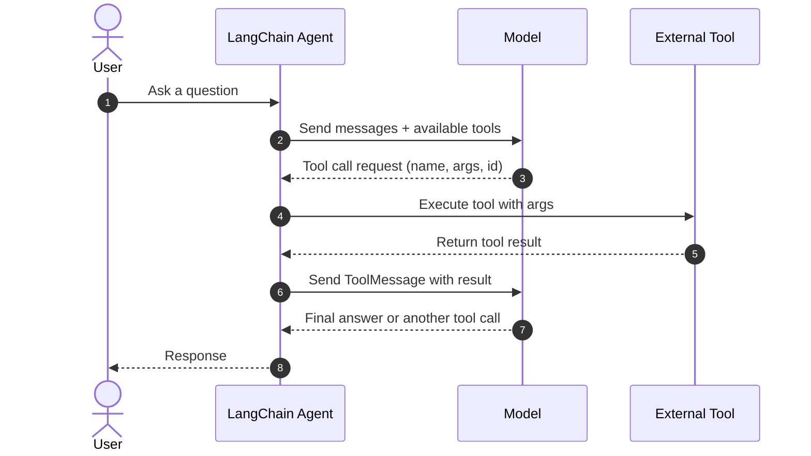
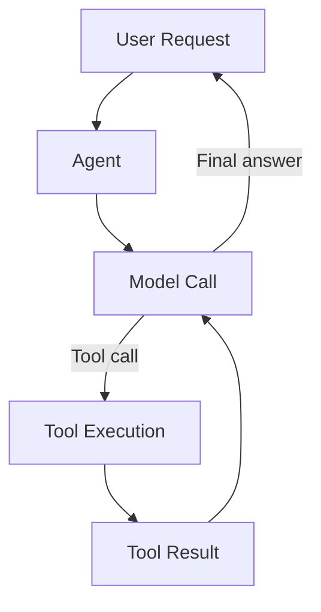
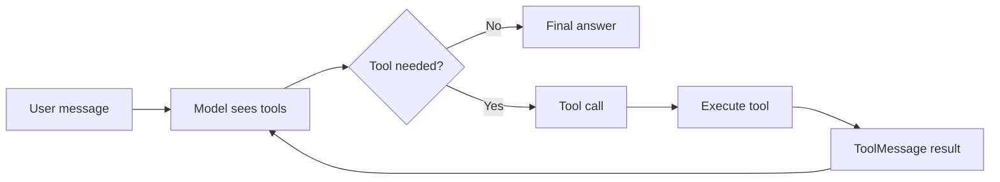
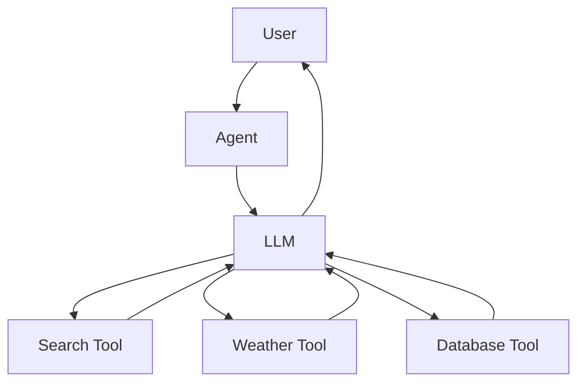
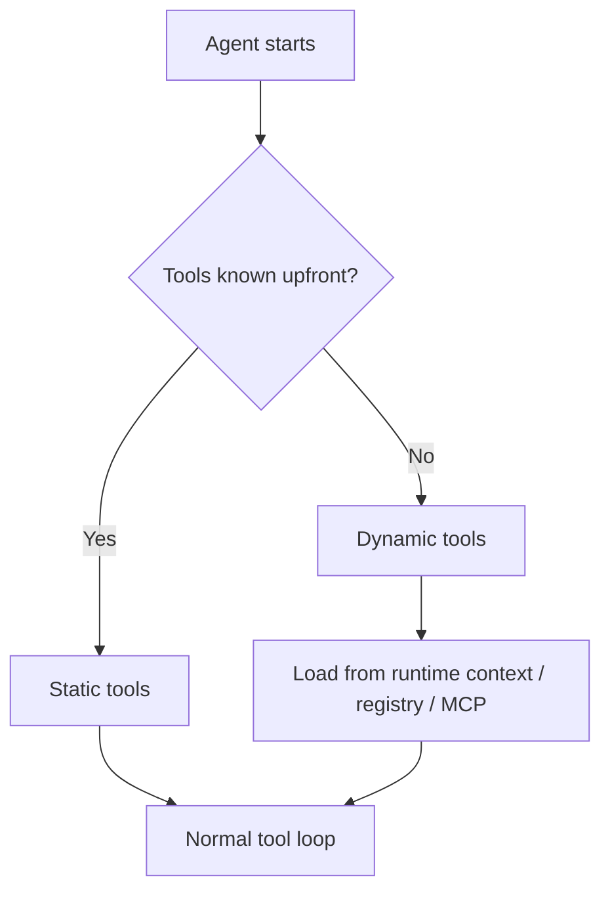

# LangChain Tools, Tool Calling, and Agent Building Guide

## Purpose of this guide

This guide explains:

1. What **tools** are in LangChain
2. How **tool calling** works
3. The main **concepts and types** you need to know
4. How to build **agents** using tools
5. Practical **examples**, **flows**, and **Mermaid diagrams**

This is written as a learner-friendly, end-to-end guide.

---

## 1) What is a Tool in LangChain?

A **tool** is a callable function that the model can use to interact with something outside the LLM itself.

Typical tools:

- Search the web
- Query a database
- Call an API
- Run calculations
- Read files
- Fetch user-specific data
- Trigger an action in an app

### Simple definition

A tool is usually made of two parts:

- **Schema**: What inputs the tool expects
- **Executable function**: The code that runs when the tool is called

### Why tools matter

LLMs are good at language, reasoning, and planning. They are not reliable for:

- real-time data
- private data access
- exact calculations
- side effects such as sending emails or updating records

Tools solve that gap.

---

## 2) What is Tool Calling?

**Tool calling** is the mechanism where the model decides:

1. that it needs external help
2. which tool to call
3. what arguments to send
4. how to use the tool result in the final answer

### In plain language

The model does not directly "know" the answer. Instead, it can say:

> I need to call `get_weather` with `location = Mumbai`.

Then LangChain runs the tool, captures the result, and sends it back to the model.

### Important terms

- **Tool call**: the model’s request to execute a tool
- **Tool execution**: the actual running of the tool function
- **Tool result**: output returned by the tool
- **Tool message**: the message that carries the tool result back into the conversation

---

## 3) Core Concepts You Must Know

### 3.1 Tool schema

A tool must tell the model:

- its name
- what it does
- what input it needs

In LangChain Python, type hints and docstrings are often used to build this schema.

### 3.2 Tool binding

The model must be told which tools it is allowed to use.

This is often done by **binding tools** to the model or by passing tools into an agent.

### 3.3 Tool call object

A tool call usually contains:

- `name`: tool name
- `args`: structured arguments
- `id`: unique call id

### 3.4 Tool result message

After the tool runs, the output is passed back as a `ToolMessage`.

### 3.5 Agent loop

Agents usually work in a loop:

1. Model thinks
2. Model decides whether to call a tool
3. Tool runs
4. Result is returned to the model
5. Model continues or ends

### 3.6 Static vs dynamic tools

- **Static tools**: fixed at agent creation time
- **Dynamic tools**: added or changed at runtime

### 3.7 Structured output

Sometimes you want the model to return a structured response, not free-form text.

LangChain supports structured output patterns alongside tool calling.

---

## 4) Tool Calling Flow in LangChain

Here is the standard flow.



### What happens internally

- The model sees the user request and available tools.
- It chooses whether a tool is necessary.
- If yes, it emits a structured tool call.
- LangChain executes the tool.
- The result is returned as tool output.
- The model uses the result to continue reasoning.

---

## 5) Tool Types and Related Concepts

This section groups the main ideas you will see in LangChain.

| Concept | Meaning | Why it matters |
|---|---|---|
| Tool | Callable function used by the model | Extends model capability |
| Tool schema | Input contract for the tool | Helps the model send valid args |
| Tool call | Model’s request to run a tool | Central to tool calling |
| ToolMessage | Message containing tool output | Feeds results back to the model |
| Static tool | Defined before runtime | Simple and common |
| Dynamic tool | Added at runtime | Good for permissions or feature flags |
| Bound tools | Tools attached to a model | Enables tool use |
| Agent | LLM + tools + loop | Orchestrates reasoning and action |
| ReAct loop | Reasoning + Acting cycle | Common agent behavior |
| Structured output | Typed response format | Useful for extraction and APIs |
| Middleware | Hooks around model/tool execution | Great for customization |
| MCP tool | Tool exposed through Model Context Protocol | Useful for external tool ecosystems |

---

## 6) Creating a Tool in LangChain

The simplest way is usually the `@tool` decorator.

### Example: a basic tool

```python
from langchain.tools import tool

@tool
def search_database(query: str, limit: int = 10) -> str:
    """Search the customer database for records matching the query.

    Args:
        query: Search terms to look for
        limit: Maximum number of results to return
    """
    return f"Found {limit} results for '{query}'"
```

### Why this works

- The function name becomes the tool name
- The docstring becomes the description
- Type hints define the input schema

### Best practices for tool design

Keep tool descriptions:

- short
- accurate
- action-oriented

Keep tool inputs:

- explicit
- typed
- minimal

Keep tool outputs:

- structured when possible
- easy for the model to reuse

---

## 7) Tool Calling Example with Two Tools

Here is a simple agent with a search tool and a weather tool.

```python
from langchain.tools import tool
from langchain.agents import create_agent

@tool
def search(query: str) -> str:
    """Search for information."""
    return f"Results for: {query}"

@tool
def get_weather(location: str) -> str:
    """Get weather information for a location."""
    return f"Weather in {location}: Sunny, 72°F"

agent = create_agent(
    model="gpt-4.1",
    tools=[search, get_weather],
)

result = agent.invoke({
    "messages": [
        {"role": "user", "content": "Find the weather in Mumbai and search for local events."}
    ]
})

print(result)
```

### What to notice

- Both tools are available to the model
- The model may call one tool or both
- The agent keeps looping until it reaches a final answer

---

## 8) How Tool Calling Happens Step by Step

### Step 1: User asks a question

Example:

> What is the weather in Mumbai right now?

### Step 2: Agent sends messages and tools to the model

The model receives:

- conversation history
- system instructions
- available tools

### Step 3: Model emits a tool call

The model may return something like:

```json
{
  "name": "get_weather",
  "args": {
    "location": "Mumbai"
  },
  "id": "call_123"
}
```

### Step 4: LangChain executes the tool

LangChain runs `get_weather(location="Mumbai")`.

### Step 5: Tool result is wrapped into ToolMessage

The result is inserted back into the conversation.

### Step 6: Model reads the result

The model can now answer:

> Mumbai is sunny and 72°F.

### Step 7: Optional repeat

If the task needs more work, the model may call another tool.

---

## 9) Static Tools vs Dynamic Tools

### Static tools

Static tools are defined when the agent is created.

Use this when:

- tool set is known in advance
- behavior is stable
- you want the simplest architecture

### Dynamic tools

Dynamic tools are added or changed during execution.

Use this when:

- user permissions affect tool access
- feature flags change availability
- tools are loaded from a registry, database, or MCP server
- only some tools should be visible in a given context

### Comparison

| Feature | Static Tools | Dynamic Tools |
|---|---|---|
| Defined when | Agent creation | Runtime |
| Complexity | Lower | Higher |
| Flexibility | Lower | Higher |
| Best for | Fixed workflows | Adaptive systems |

---

## 10) Agent Architecture for Tool Calling

An agent is not just a model. It is a control loop.



### The agent loop

Typical cycle:

1. model call
2. tool execution
3. model call with tool result
4. final answer or another tool call

This is the core of most tool-using agents.

---

## 11) ReAct Pattern

LangChain agents commonly follow **ReAct**: **Reasoning + Acting**.

### Why it helps

The model can:

- reason briefly
- choose a tool
- observe the result
- refine the next action

### Example behavior

User asks:

> Find the most popular wireless headphones and verify availability.

The agent may:

1. think that this is time-sensitive
2. call search or product tools
3. inspect results
4. check stock or availability
5. produce a final answer

---

## 12) Error Handling for Tools

Tools can fail.

Common reasons:

- invalid input
- network issues
- API errors
- division by zero
- authentication failure

LangChain supports custom error handling so the model gets a useful message instead of a crash.

### Example pattern

```python
from langchain.agents import create_agent
from langchain.agents.middleware import wrap_tool_call
from langchain.messages import ToolMessage

@wrap_tool_call
def handle_tool_errors(request, handler):
    try:
        return handler(request)
    except Exception as e:
        return ToolMessage(
            content=f"Tool error: Please check your input and try again. ({str(e)})",
            tool_call_id=request.tool_call["id"]
        )

agent = create_agent(
    model="gpt-4.1",
    tools=[search, get_weather],
    middleware=[handle_tool_errors]
)
```

### Why this is important

Without error handling, the agent can fail hard.
With it, the model can recover, retry, or explain the issue.

---

## 13) Building an Agent from Tools

This is the practical recipe.

### Step 1: Define the tools

Use functions with type hints and docstrings.

### Step 2: Choose the model

Use a model that supports tool calling.

### Step 3: Create the agent

Pass the model and tools into `create_agent`.

### Step 4: Invoke the agent

Send a user message in a `messages` list.

### Step 5: Add memory, prompts, or middleware if needed

Improve behavior with:

- system prompts
- state
- runtime context
- middleware
- error handlers

### Step 6: Test the behavior

Check:

- tool selection
- argument accuracy
- tool result quality
- final response quality

---

## 14) Minimal Agent Example

```python
from langchain.tools import tool
from langchain.agents import create_agent

@tool
def calculator(expression: str) -> str:
    """Evaluate a simple arithmetic expression."""
    return str(eval(expression))

agent = create_agent(
    model="gpt-4.1",
    tools=[calculator],
    system_prompt="You are a careful assistant. Use the calculator for math."
)

response = agent.invoke({
    "messages": [
        {"role": "user", "content": "What is 18 * 27?"}
    ]
})

print(response)
```

### Notes

- The model may call the calculator tool
- The agent handles the loop
- The final answer can include the computed result

> In production, do not use raw `eval` for untrusted input. Replace it with a safe parser.

---

## 15) Example Use Cases

### Use case 1: Customer support agent

Tools:

- account lookup
- order status
- refund request
- knowledge base search

Flow:

- user asks about an order
- agent fetches account/order data
- agent explains the status

### Use case 2: Research assistant

Tools:

- web search
- document retrieval
- citation lookup
- summary generator

Flow:

- user asks a research question
- agent searches sources
- agent synthesizes the answer

### Use case 3: Operations assistant

Tools:

- calendar booking
- ticket creation
- CRM update
- email draft/send

Flow:

- user requests a task
- agent validates details
- agent performs the action

### Use case 4: Finance dashboard assistant

Tools:

- portfolio lookup
- price fetcher
- risk calculator
- report generator

Flow:

- user asks for performance
- agent fetches data
- agent computes insights

---

## 16) Mermaid Diagrams for Learners

### A. Tool calling lifecycle



### B. Agent with multiple tools



### C. Static vs dynamic tool selection



---

## 17) Advanced Concepts

### 17.1 Parallel tool calls

Agents can sometimes call multiple tools in sequence or in parallel when the task allows it.

Example:

- fetch weather
- fetch stock price
- compare both

### 17.2 Dynamic system prompts

You can change the agent’s behavior using runtime context.

Example:

- beginner mode: explain simply
- expert mode: be technical

### 17.3 State

Agents can keep additional state beyond messages, such as:

- user preferences
- session data
- workflow progress

### 17.4 Middleware

Middleware can intercept:

- model requests
- tool calls
- prompt generation
- state updates

This is useful for:

- logging
- access control
- error handling
- tool injection

### 17.5 Structured output vs tool calling

These are related but not identical.

- **Tool calling**: model decides to invoke a function
- **Structured output**: model must return data in a defined schema

Sometimes LangChain uses tool-like mechanics to enforce structured output.

---

## 18) LangChain vs LangGraph in Tool-Based Agents

LangChain provides higher-level agent creation and tool integration.

LangGraph is the lower-level orchestration layer for:

- durable execution
- streaming
- human-in-the-loop
- long-running stateful systems

### Practical rule

- Use **LangChain agents** when you want a fast, higher-level start
- Use **LangGraph** when you need deeper control over orchestration and state

---

## 19) MCP Tools

LangChain can also work with tools exposed through **Model Context Protocol (MCP)** servers.

### What that means

An MCP server can expose executable functions. LangChain can convert those into LangChain tools.

This is useful when you want tools from external systems to be usable in agents.

---

## 20) Common Mistakes

### Mistake 1: Writing vague tool descriptions

Bad:

- "Does stuff"

Better:

- "Search customer records by email or order id"

### Mistake 2: Missing type hints

Without clear input types, the model can produce bad tool arguments.

### Mistake 3: Too many tools at once

Too many tools can overload the model.

### Mistake 4: Unsafe tool code

Tools can cause side effects. Treat them like production code.

### Mistake 5: No error handling

A single tool failure can break the agent flow if not handled well.

---

## 21) Recommended Learning Path

### Level 1: Understand tools

Learn:

- what tools are
- how to define one
- how the model chooses them

### Level 2: Understand tool calling

Learn:

- tool calls
- tool messages
- model-tool loop
- structured arguments

### Level 3: Build a basic agent

Learn:

- `create_agent`
- static tools
- simple prompts

### Level 4: Add robustness

Learn:

- error handling
- middleware
- state
- memory

### Level 5: Scale up

Learn:

- dynamic tools
- multi-agent patterns
- LangGraph orchestration
- MCP integration

---

## 22) Practical Cheat Sheet

### When to use a tool

Use a tool when the model needs to:

- fetch fresh data
- access private systems
- run computations
- trigger side effects
- retrieve documents

### When not to use a tool

Do not use a tool when the model can safely answer from context alone.

### Good tool names

- `get_weather`
- `search_orders`
- `calculate_tax`
- `send_email`

### Good tool descriptions

- action-focused
- concise
- specific

### Good tool outputs

- structured
- readable
- easy to chain into the next model step

---

## 23) End-to-End Mental Model

Think of LangChain tool calling like this:

1. The user asks something.
2. The model inspects the request.
3. The model decides whether a tool is needed.
4. LangChain runs the tool.
5. The result returns as a tool message.
6. The model uses that result to answer or continue.
7. The agent stops when the task is complete.

---

## 24) Final Summary

- A **tool** is a function the model can call.
- **Tool calling** is the structured way the model requests tool execution.
- An **agent** is the orchestration loop that keeps calling the model and tools until the task is done.
- **Static tools** are fixed at creation time.
- **Dynamic tools** are added or changed at runtime.
- **ToolMessage** carries tool output back to the model.
- **Middleware**, **state**, and **error handling** make agents production-ready.
- **LangGraph** is the lower-level runtime for complex, stateful orchestration.

---

## 25) Quick Reference Example

```python
from langchain.tools import tool
from langchain.agents import create_agent

@tool
def get_weather(location: str) -> str:
    """Get the current weather for a location."""
    return f"Weather in {location}: clear skies"

agent = create_agent(
    model="gpt-4.1",
    tools=[get_weather],
    system_prompt="Use tools when needed and answer clearly."
)

result = agent.invoke({
    "messages": [
        {"role": "user", "content": "What's the weather in Kolkata?"}
    ]
})

print(result)
```

---

## 26) Suggested Next Exercises

Try building:

1. a calculator tool
2. a weather tool
3. a database lookup tool
4. a tool that reads a file
5. an agent that chooses among them
6. a dynamic-tool agent with access control
7. a multi-step workflow with LangGraph

---

End of guide.
