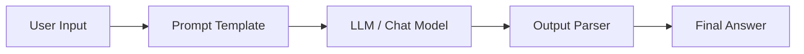
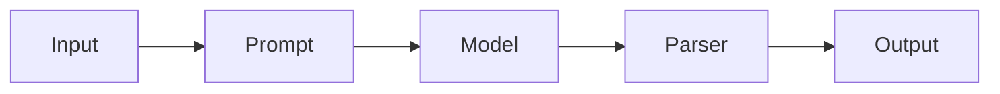
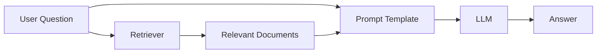
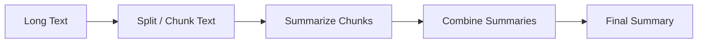
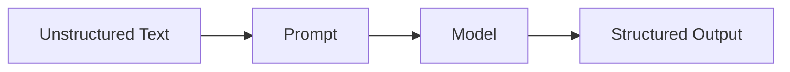
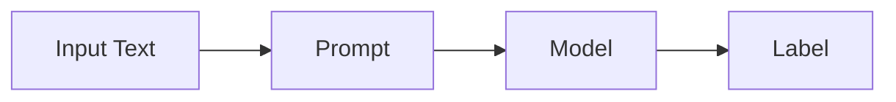
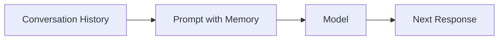
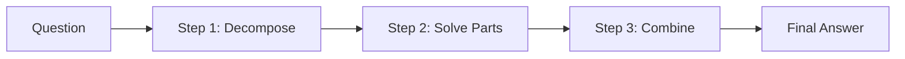
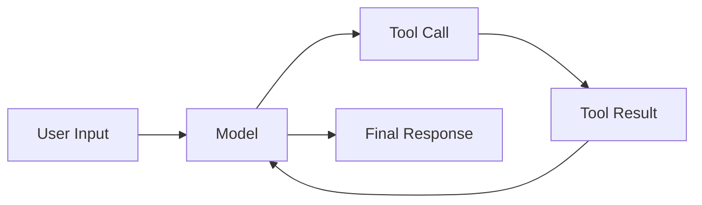
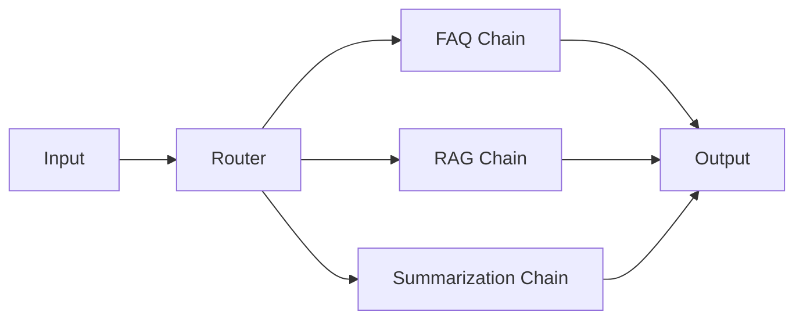

# LangChain Chains: Fundamentals, Types, Use Cases, and Diagrams

## 1) What is a chain in LangChain?

A **chain** in LangChain is a sequence of steps that transforms an input into an output.

In practice, a chain usually combines components such as:

- a **prompt template**,
- a **model / LLM / chat model**,
- an **output parser**,
- and sometimes **retrievers**, **tools**, or **custom functions**.

Think of a chain as a pipeline:

`Input -> Step 1 -> Step 2 -> Step 3 -> Output`

### Simple idea

If you give a user question to the chain, the chain may:

1. format the question into a prompt,
2. send it to the model,
3. parse the model response,
4. return the final answer.

---

## 2) Chain as a fundamental concept

Chains are one of the most important building blocks in LangChain because they let you:

- break a problem into smaller steps,
- keep code modular,
- reuse components,
- add retrieval, memory, tools, and parsing,
- create workflows that are easier to test and maintain.

### Why chains matter

Without chains, an application often becomes one large prompt call.

With chains, you can split the workflow into clear parts:

- prepare input,
- enrich context,
- call model,
- post-process output.

This structure is especially useful for:

- chatbots,
- retrieval-augmented generation (RAG),
- summarization,
- extraction,
- classification,
- multi-step reasoning workflows.

---

## 3) How chains are represented in modern LangChain

Modern LangChain emphasizes **LCEL (LangChain Expression Language)** and the **Runnable** interface.

A very common chain looks like this:

```python
chain = prompt | model | output_parser
```

This means:

- `prompt` formats the input,
- `model` generates a response,
- `output_parser` converts the model output into a useful format.

So, when people say “chain,” they often mean a **composed runnable pipeline**.

---

## 4) Anatomy of a basic chain

### Core parts

#### a) Prompt template
Turns raw input into a structured instruction for the model.

#### b) Model
Generates text, JSON, or structured output.

#### c) Output parser
Converts the raw response into a Python object, string, JSON, or schema-based result.

### Example

```python
from langchain_core.prompts import ChatPromptTemplate
from langchain_openai import ChatOpenAI
from langchain_core.output_parsers import StrOutputParser

prompt = ChatPromptTemplate.from_template(
    "Explain {topic} in simple terms."
)

model = ChatOpenAI(model="gpt-4.1-mini")
parser = StrOutputParser()

chain = prompt | model | parser
result = chain.invoke({"topic": "LangChain chains"})
print(result)
```

### Diagram



---

## 5) Different types of chains in LangChain

There are many ways to classify chains. The most practical categories are below.

### 5.1 Simple sequential chain

A sequential chain passes output from one step directly to the next.

**Use case:** text rewriting, translation, tone transformation, short workflows.



**Example use case**
- Rewrite a paragraph in simpler English.
- Convert a customer complaint into a professional reply.

---

### 5.2 LLM chain / prompt-model chain

This is the most basic chain pattern:

- prompt
- model
- output parser

**Use case:** chat response generation, question answering, classification.

**Example**
- “Classify this review as positive or negative.”

---

### 5.3 Retrieval chain (RAG chain)

A retrieval chain first fetches relevant documents, then uses them in the prompt.

**Use case:** document question answering, knowledge base chatbots, policy assistants.



**How it works**
1. The retriever searches a vector store or document index.
2. Relevant chunks are selected.
3. The model answers using that context.

**Example use case**
- Ask questions from company manuals.
- Search and answer from PDF documents.
- Build a support bot for internal knowledge.

---

### 5.4 Summarization chain

A summarization chain reduces long text into a shorter version.

**Use case:** meeting notes, article summaries, transcript compression, report generation.



**Common patterns**
- **Stuff**: put all text into one prompt if it is short enough.
- **Map-Reduce**: summarize pieces first, then combine.
- **Refine**: start with one summary and improve it step by step.

**Example use case**
- Summarize a 20-page PDF into 5 bullet points.

---

### 5.5 Extraction chain

An extraction chain pulls structured data from unstructured text.

**Use case:** invoice parsing, resume parsing, entity extraction, form filling.



**Example**
- Extract name, email, phone, and skills from a resume.

---

### 5.6 Classification chain

A classification chain assigns labels to input text.

**Use case:** sentiment analysis, spam detection, ticket routing, intent classification.



**Example**
- Route a support ticket to “Billing”, “Technical”, or “General”.

---

### 5.7 Conversational chain

A conversational chain uses chat history to continue a dialogue.

**Use case:** assistants, customer support bots, tutoring bots.



**Example**
- The bot remembers what the user asked earlier in the session.

---

### 5.8 Multi-step reasoning chain

A multi-step chain breaks a problem into smaller reasoning tasks.

**Use case:** planning, analysis, comparison, decision support.



**Example**
- Compare two software tools based on features, cost, and ease of use.

---

### 5.9 Tool-using chain

A tool-using chain calls external tools during execution.

**Use case:** search, calculators, APIs, databases, internal services.



**Example**
- Ask a bot to check weather, search the web, or query a database.

---

### 5.10 Router chain

A router chain sends input to different chains based on intent.

**Use case:** choose the right workflow automatically.



**Example**
- If the input is a question about documents, use retrieval.
- If the input is a short rewrite request, use a simple prompt chain.

---

## 6) Common chain patterns you should know

### Pattern 1: Prompt -> Model -> Parser
The most basic and most used pattern.

### Pattern 2: Retriever -> Prompt -> Model
Used in RAG.

### Pattern 3: Split -> Process chunks -> Combine
Used in summarization and long-document workflows.

### Pattern 4: Route -> Specialized chain
Used when one pipeline is not enough for all requests.

### Pattern 5: Model -> Tool -> Model
Used in agents and tool-augmented workflows.

---

## 7) Real-world use cases

### Customer support chatbot
- Understand user question
- Retrieve policy/FAQ documents
- Generate a grounded answer

### Resume screening
- Extract candidate data
- Classify fit for role
- Generate shortlist notes

### Content summarizer
- Read article or meeting transcript
- Create summary and action items

### Ticket triage
- Classify incoming support tickets
- Route to the right team

### Knowledge assistant
- Search internal documents
- Answer with citations or references

### Data extraction
- Parse invoices, forms, receipts, contracts

---

## 8) When to use a chain vs an agent

### Use a chain when:
- the workflow is mostly fixed,
- steps are known in advance,
- you want predictability,
- you want easier testing.

### Use an agent when:
- the model must decide which tools to use,
- the workflow is dynamic,
- the next step depends on runtime reasoning.

A good rule:

- **Chain = predefined workflow**
- **Agent = decision-making workflow**

---

## 9) Advantages of chains

- Easy to understand
- Easy to debug
- Easy to reuse
- Modular design
- Better control over prompts and outputs
- Good for production workflows

---

## 10) Limitations of chains

- Less flexible than agents
- Fixed flow can be limiting
- Complex workflows may need routing or orchestration
- Long chains can be harder to maintain if not designed well

---

## 11) Best practices

- Keep each step small and focused.
- Use output parsers for structured results.
- Add retrievers only when needed.
- Test each chain step separately.
- Prefer simple chains before moving to agents.
- Use clear prompts and explicit output formats.

---

## 12) Summary

A **chain** in LangChain is a composable workflow that connects components like prompts, models, retrievers, parsers, and tools.

The most common chain is:

`Prompt -> Model -> Output Parser`

Other important chain patterns include:

- retrieval chains,
- summarization chains,
- extraction chains,
- classification chains,
- conversational chains,
- router chains,
- tool-using chains.

Chains are foundational because they turn LLM applications into clear, reusable, and maintainable pipelines.

---

## 13) Quick revision notes

- **Chain** = sequence of steps
- **LCEL / Runnable** = modern way to compose chains
- **RAG chain** = retrieve context, then answer
- **Summarization chain** = compress long text
- **Extraction chain** = structured data from text
- **Router chain** = choose a path
- **Agent** = dynamic tool-using decision maker
