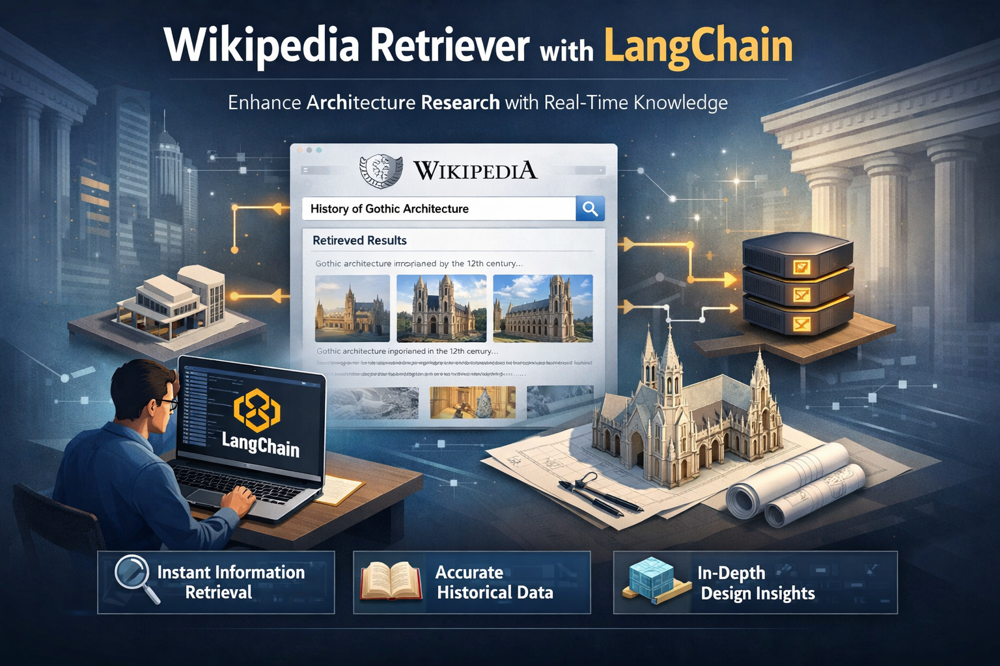

A detailed architectural workflow diagram illustrating the use case of a Wikipedia Retriever using LangChain. The scene is a modern, clean, tech-style infographic with a dark blue gradient background and glowing data connections.

The composition is an isometric, semi-3D system flow:

1. User Query Input — a developer sitting at a laptop entering a query like "History of Gothic Architecture"
2. LangChain Framework — central glowing cube with interconnected chain-like nodes representing orchestration
3. Wikipedia Retriever Module — a document retrieval interface styled like Wikipedia, fetching structured content and images
4. Processing & Embeddings Layer — visualized as a vector database with floating data points and embedding clusters
5. LLM Response Generator — a futuristic AI brain emitting light, representing summarization and reasoning
6. Final Output Display — a clean UI panel showing summarized architectural insights and building images

Directional arrows clearly show data flow between each component.

Add subtle icons for documents, AI processing, and data pipelines. Use soft futuristic lighting with glowing accents around nodes and connections. Maintain minimal text labels for clarity.

Balanced layout suitable for a technical presentation slide, with high visual clarity and depth.

